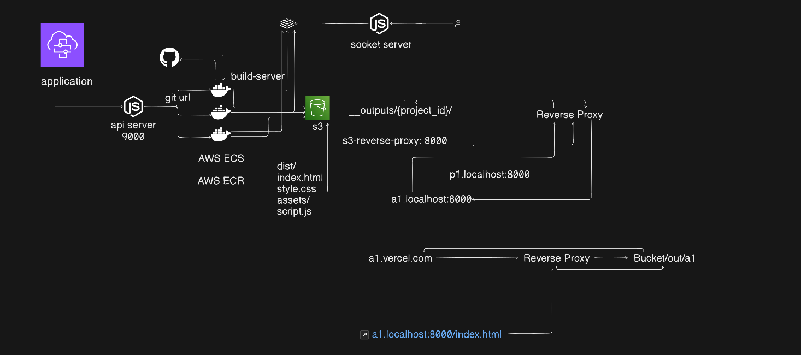

# Exonium

**Deploy frontend projects instantly from Git.**

A Vercel-like deployment platform that automatically builds and hosts your frontend projects from any Git repository.

---

## Architecture



### Components

| Service | Description |
|---------|-------------|
| **api-server** | REST API + WebSocket server. Accepts deploy requests and streams build logs |
| **build-server** | Docker container that clones repos, builds them, and uploads to S3 |
| **s3-reverse-proxy** | Serves built sites from S3 based on subdomain |

---

## Getting Started

### Prerequisites

- Node.js v20+
- Docker
- AWS Account (ECS, S3, ECR)
- Redis instance (we use Aiven)

### 1. Clone the repo

```bash
git clone https://github.com/cyruswastaken/notExonium.git
cd notExonium
```

### 2. Setup API Server

```bash
cd api-server
npm install
cp .env.example .env
# Edit .env with your credentials
node index.js
```

### 3. Setup Reverse Proxy

```bash
cd s3-reverse-proxy
npm install
node index.js
```

### 4. Build & Push Docker Image

```bash
cd build-server
1. docker build -t builder-server .
2. docker tag builder-server:latest <your-ecr-url>/builder-server:latest
3. docker push <your-ecr-url>/builder-server:latest
```

---

## Environment Variables

### api-server/.env

```env
AWS_REGION=ap-south-1
AWS_ACCESS_KEY_ID=your_access_key
AWS_SECRET_ACCESS_KEY=your_secret_key
REDIS_URL=your_redis_url
ECS_CLUSTER=your_ecs_cluster_arn
ECS_TASK=your_ecs_task_arn
```

### build-server (ECS Task Definition)

Set these in your ECS Task Definition environment variables:

| Variable | Description |
|----------|-------------|
| `AWS_REGION` | AWS region |
| `AWS_ACCESS_KEY_ID` | AWS access key |
| `AWS_SECRET_ACCESS_KEY` | AWS secret key |
| `REDIS_URL` | Redis connection URL |
| `PROJECT_ID` | Passed per task (auto-generated slug) |
| `GIT_REPOSITORY__URL` | Passed per task (user's repo URL) |

---

## API Usage

### Deploy a Project

```bash
POST http://localhost:9000/project
Content-Type: application/json

{
  "gitURL": "https://github.com/username/repo"
}
```

**Response:**
```json
{
  "status": "queued",
  "data": {
    "projectSlug": "random-word-slug",
    "url": "https://random-word-slug.localhost:8000"
  }
}
```

### Stream Build Logs

Connect via WebSocket to port 9001 and subscribe to the project channel:

```javascript
const socket = io('http://localhost:9001');
socket.emit('subscribe', `logs:${projectSlug}`);
socket.on('message', (log) => console.log(log));
```

---

## How It Works

1. **User sends deploy request** with Git URL to API server
2. **API server** generates a unique slug and spins up an ECS Fargate task
3. **Build server** (container):
   - Clones the Git repository
   - Runs `npm install && npm run build`
   - Uploads `dist/` folder to S3
   - Streams logs to Redis
4. **User accesses** `https://{slug}.localhost:8000`
5. **Reverse proxy** fetches files from S3 and serves them

---

## Tech Stack

- **Backend:** Node.js, Express
- **Container Orchestration:** AWS ECS Fargate
- **Storage:** AWS S3
- **Realtime:** Socket.io, Redis Pub/Sub
- **Containerization:** Docker

---

## Roadmap

### Not Yet Implemented

- [ ] **Frontend Dashboard** - Web UI for deploying projects, viewing build logs, and managing deployments
- [ ] **Database Integration** - Store project metadata, deployment history, and user information
- [ ] **User Authentication** - Login/signup, OAuth (GitHub, Google)
- [ ] **Custom Domains** - Allow users to connect their own domains
- [ ] **Build Caching** - Cache `node_modules` to speed up subsequent builds
- [ ] **Rollback Support** - Ability to rollback to previous deployments
- [ ] **Environment Variables UI** - Let users set env vars for their builds

### Future Improvements

- [ ] **Multi-framework Support** - Support for Next.js SSR, Astro, SvelteKit, etc.
- [ ] **Preview Deployments** - Auto-deploy on PR creation
- [ ] **GitHub/GitLab Webhooks** - Auto-deploy on push
- [ ] **Build Notifications** - Slack, Discord, Email notifications
- [ ] **Analytics Dashboard** - View traffic, bandwidth usage
- [ ] **Team Collaboration** - Multiple users per project
- [ ] **Rate Limiting & Quotas** - Prevent abuse
- [ ] **CDN Integration** - CloudFront for faster global delivery
- [ ] **Monorepo Support** - Deploy specific packages from monorepos
- [ ] **Build Timeouts** - Configurable timeout limits
- [ ] **HTTPS with SSL Certificates** - Auto-provision SSL via Let's Encrypt

---

## Team

Built by the someone.

---

## License

MIT
